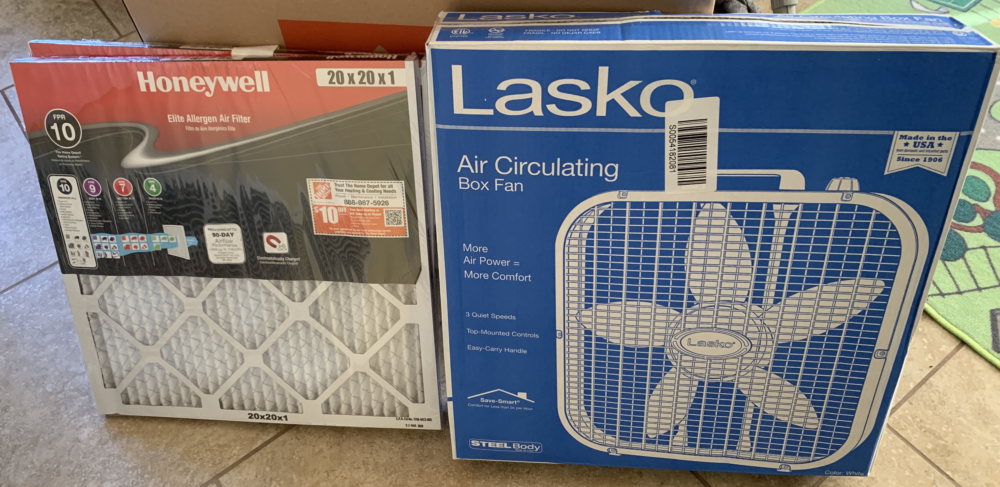
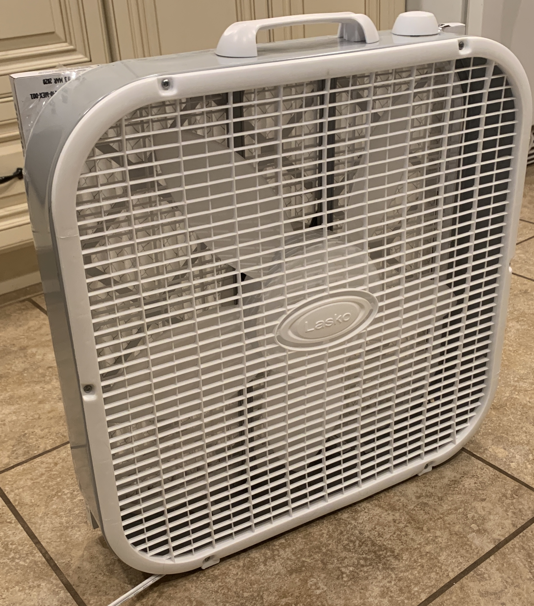
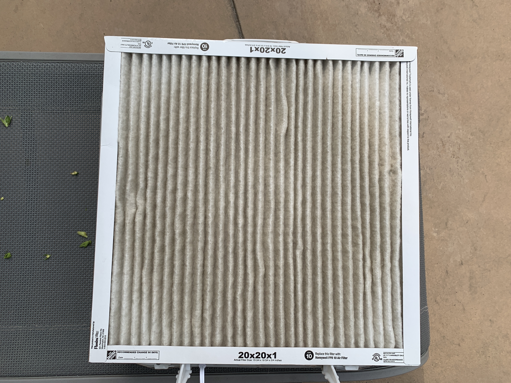

Wildfires have been a real issue in California the past 3 years. Wanted to share DIY low cost and portable solution to filter and monitor the air quality inside your home.

# Portable Air Purifier

The idea came from a search I did in YouTube for "DIY Air Purifier". [Here is a good video](https://youtu.be/YnIvLBe6xUE) that explains how to build it, and how it compares with commercial air purifiers that cost hundreds of dollars.

|  | |
|---|---|
|     |

## Materials
* 20 inch square fan: bought it at Home Depot for $20. Here is a [similar model in Amazon](https://amzn.to/2COs5aW)
* Pleated Air Filter 20 in. x 20 in. x 1 in., FPR 10 / MERV 13: Bought it at Home Depot for $20. Here is a [similar model in Amazon](https://amzn.to/2Qhy6jE)

## Review

Seems to do its work, but the box fan is kind of loud (54, 59 and 65dB at each of the 3 settings)

# Portable Air Monitor

I used some IoT spare parts I had (Raspberry Pi and SenseHAT) and Particle Matter sensor I got in Amazon.

 

See this [short video showing how the measurements are displayed on the SenseHAT screen](files/pi-display-pm2.5.mov)

## Materials

* [Nova Particle Matter Sensor SDS011](https://amzn.to/34oscW1): paid $30 in Amazon. The sensor comes with a USB dongle you can use to connect to a computer, or a pi (or similar)
* [Raspberry pi](https://amzn.to/2YpTiZ0): I used a Pi 3b+ I got for $40. You can probably save some money by using a [Raspberry Zero](https://amzn.to/3l3thZk) or an [Arduino](https://amzn.to/2YoPYxB) as well
* [Raspberry Pi Sense HAT with Orientation, Pressure, Humidity and Temperature Sensors](https://amzn.to/2YpT6ZM): paid $38 in Amazon
* USB Powerbank that can power the Pi. I am using a $40 [HooToo Powerbank I bought long time ago that doubles as WiFi Access Point and media server](https://amzn.to/2YpwRmZ), but you can use any power bank that has a 5v output. 

## Software

Modified [this python code I found in GitHub that reads from SDS011](https://gist.github.com/kadamski/92653913a53baf9dd1a8) to print the particle matter measurements on the SenseHAT screen using color coding (the measurement prints green when air quality is good, yellow when moderate and red when elevated). I also capture temperature and presssure using the SenseHAT sensors

The [aqi.py](aqi.py) python script saves the measurements on a json file that is available on the Pi's Web server (/var/www/html/aqi.json) which is useful to graph measurements

## Review

Simple solution to monitor Air Quality inside your home. Commercial products that provide similar functionality cost several hundred dollars, plus I prefer to keep my data locally instead on someone else's cloud.

Update 13-SEP-2020: I have been using the filters for 3 weeks now to help with the bad air quality caused by the numerous woldfires in California and I can say the filters work pretty welll and they really lower the pm2.5 particle count. Depending on the room size they can lower the pm2.5 from 120 to under 10 within 35 minutes of use at the highest fan setting. Takes longer in larger rooms...

Here is a picture of how the filter looks after 3 weeks of heavy use (~6-8h/day)

 
