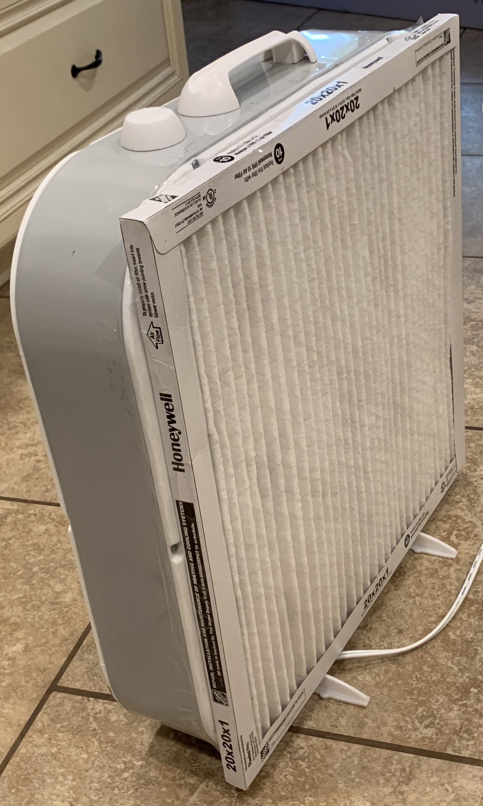

# aqi-sds011
Wildfires have been a real issue in California the past 3 years. Here is my low cost and portable solution to monitor the air quality inside your home and run home made air purifiers.

## Hardware used
### Portable Air Purifier

* 20 inch square fan: bought it at Home Depot for $20. Here is a [similar model in Amazon](https://amzn.to/2COs5aW)
* Pleated Air Filter 20 in. x 20 in. x 1 in., FPR 10 / MERV 13: Bought it at Home Depot for $20. Here is a [similar model in Amazon](https://amzn.to/2Qhy6jE)

|  |
|---|
|   |
|   |

Measuring Air Quality with a Nova SDS011 particle matter sensor

* [Nova PM Sensor SDS011](https://amzn.to/34oscW1)
* [Raspberry pi](https://amzn.to/2EkJNDH)
